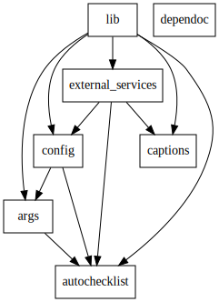

# RECC Tech

Welcome to the River's Edge Production Team repository!

- For documentation, see the [wiki](https://github.com/recc-tech/tech/wiki).
- For the issue tracker, see the [GitHub project](https://github.com/users/recc-tech/projects/1).

## Setting Up on a New Computer

1. Install Python. The scripts were developed and tested using Python 3.10.
2. Move to the `scripts/` directory.
3. Install the required external libraries by running `pip install -r setup/requirements.txt`
4. Create a desktop shortcut for each top-level script (batch files on Windows, shell scripts on macOS).
	- On Windows, run `setup/New-Shortcuts.ps1` in PowerShell.
	- On macOS, run `setup/make_shortcuts.sh` in bash.
5. Set up scripts to run on startup.
	- At the MCR station, run `startup.bat` on startup. You can do this by copying a shortcut to the script into the startup folder (https://support.microsoft.com/en-us/windows/add-an-app-to-run-automatically-at-startup-in-windows-10-150da165-dcd9-7230-517b-cf3c295d89dd).
	- At the FOH station, run `startup.command` on startup. You can do this by adding a new "login item" in the System Preferences (https://stackoverflow.com/a/6445525).
6. Activate the configuration profile by running `python manage_config.py activate`.

## Setting Up a New Development Environment

See [set-up-dev-env.sh](scripts/setup/set-up-dev-env.sh).

1. Install Python. The scripts were developed and tested using Python 3.10.
2. Move to the `scripts/` directory.
3. Create a new Python virtual environment using the command `python -m venv .venv`. Activate this virtual environment using `source .venv/bin/activate` on MacOS or `.venv/Scripts/activate` on Windows.
4. Install the required external libraries (those that are required for the main scripts as well as those that are only needed for testing) by running `pip install -r setup/requirements-dev.txt`
5. Activate the configuration profile by running `python manage_config.py activate --profile PROFILE`. To see the full list of available profiles, run `python manage_config.py list`.
6. Activate the Git pre-commit hook using `git config core.hooksPath ./.git-hooks`.

## Repository Structure

- `.git-hooks/`: [Git hooks](https://git-scm.com/book/en/v2/Customizing-Git-Git-Hooks), such as for running tests before committing code.
- `.github/workflows/`: GitHub Actions workflows, such as for opening issues for checklists on Sundays or continuous integration.
- `checklists/`: Templates for checklists.
- `scripts/`:
	- `scripts/___.py`: These are command-line programs that can be run to perform common tasks, such as generating backup slides or downloading files from Planning Center.
		- Run `foo.py` using `python foo.py` or `pythonw foo.py`.
		- See the description and extra options for `foo.py` by running `python foo.py --help`.
	- `scripts/___.{bat,command,sh}`: For each top-level Python file (e.g., `foo.py`) there should be a corresponding batch file (e.g., `foo.bat` on Windows, `foo.command` on macOS) that launches the corresponding Python script. These can be used to create desktop shortcuts.
	- Folders inside `scripts/`: Code required by the top-level Python scripts is organized into packages (i.e., subdirectories). Each one should have a file `__init__.py` that summarizes the purpose of that package. The following figure shows the dependencies between packages.

		

	- `scripts/test/`. These are tests to ensure the scripts work as expected. Run all the automated tests using `python -m unittest` or run specific automated tests using `python -m unittest discover -t . -s <PATH-TO-TESTS>`.
		- `scripts/test/unit`. These are "unit tests" - they test individual software components and avoid side-effects like accessing the file system or the Internet.
		- `scripts/test/integration`. These are "integration tests" - they test multiple components or have side-effects like accessing the file system or the Internet. As a result, they tend to be slower.
		- `scripts/test/manual`. This package is meant to guide you through testing the project for cases where automated testing is impractical. Run it by moving into the `scripts` directory and then running `python -m test.manual`.
